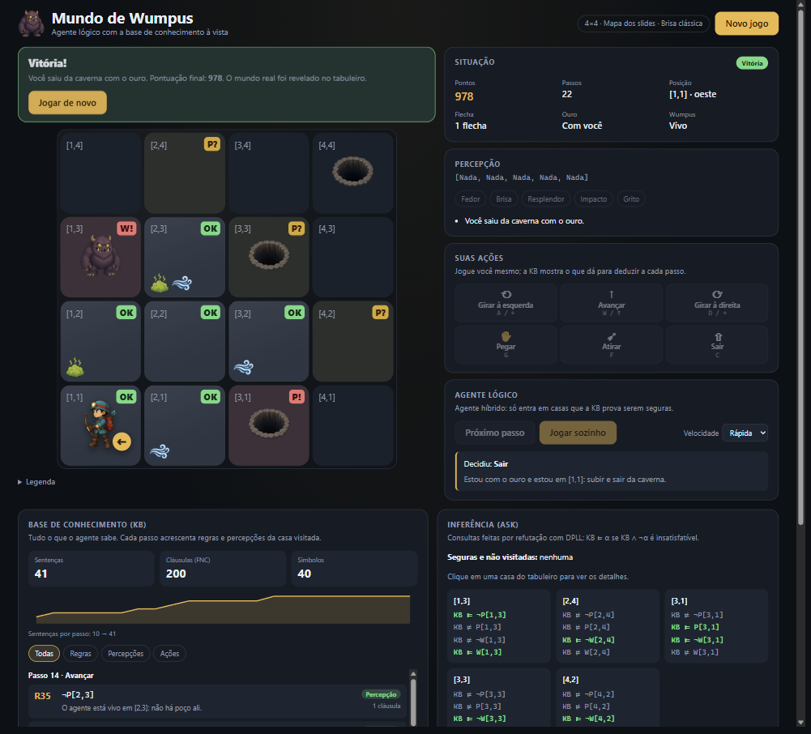

# Mundo de Wumpus · agente lógico com a KB à vista

Implementação do Mundo de Wumpus da aula de agentes lógicos (Russell & Norvig, cap. 7), feita para a disciplina de Fundamentos de Inteligência Artificial. Você pode jogar e ver, a cada passo, o que a base de conhecimento (KB) consegue deduzir, ou deixar um agente lógico jogar sozinho, explicando cada decisão.



- Tabuleiro de 4×4 a 8×8, com o mapa exato dos slides ou mundos aleatórios reproduzíveis pelo código do mapa (a semente do sorteio).
- A KB aparece inteira, agrupada pelo passo que acrescentou cada sentença, com contagem de sentenças, cláusulas e símbolos e um gráfico do crescimento.
- Inferência por refutação com DPLL e a tabela de modelos dos poços da fronteira (a mesma dos slides: 3 modelos em 8 atribuições).
- Modo de brisa com intensidade: duas covas vizinhas geram "Brisa ×2", e a KB passa a saber que há exatamente 2 poços em volta.
- A partida fica salva no navegador, então recarregar a página não perde o jogo.

## Regras (PEAS)

- **Ambiente:** grade N×N. O agente começa em [1,1], virado para o leste, com uma flecha. Há um Wumpus, um ouro e poços (cada casa, exceto [1,1], tem 20% de chance por padrão).
- **Sensores:** `[Fedor, Brisa, Resplendor, Impacto, Grito]`.
  - Fedor nas casas vizinhas (não diagonais) ao Wumpus; Brisa nas vizinhas a um poço; Resplendor na casa do ouro.
  - Impacto ao andar contra a parede; Grito quando a flecha mata o Wumpus.
- **Atuadores:** girar à esquerda, girar à direita, avançar, pegar, atirar (em linha reta, na direção em que está virado) e sair (só em [1,1]).
- **Medida de desempenho:** +1000 por sair com o ouro, −1000 por morrer (cair em um poço ou entrar na casa do Wumpus vivo), −1 por ação e −10 pela flecha.

### Brisa clássica × brisa com intensidade

Escolhida em "Novo jogo":

| Modo        | Percepção                               | O que entra na KB                                           |
| ----------- | --------------------------------------- | ----------------------------------------------------------- |
| Clássica    | Brisa: sim/não                          | `B[x,y] ⇔ (P[vizinho1] ∨ P[vizinho2] ∨ ...)`                |
| Intensidade | Brisa ×k (k = número de poços vizinhos) | a regra acima e mais "exatamente k de {P[vizinhos]}" em FNC |

No modo de intensidade, uma casa entre dois poços mostra o selo **×2** no tabuleiro.

## Como a KB funciona

Os símbolos seguem a notação da aula: `P[x,y]` (poço), `W[x,y]` (Wumpus), `B[x,y]` (brisa), `S[x,y]` (fedor), `G[x,y]` (resplendor) e `WumpusVivo`.

1. **Conhecimento inicial:** `¬P[1,1]`, `¬W[1,1]`, "existe pelo menos um Wumpus" e "existe no máximo um Wumpus" (pares `¬W[i] ∨ ¬W[j]`).
2. **Primeira visita a uma casa** (cada regra entra uma vez só):
   - `¬P[x,y]` e `¬W[x,y]`, porque o agente está vivo ali;
   - `B[x,y] ⇔ (...)` e `S[x,y] ⇔ (...)` para as vizinhas;
   - os literais percebidos (`B[x,y]` ou `¬B[x,y]`, `S[x,y]` ou `¬S[x,y]`);
   - no modo de intensidade, "exatamente k" sobre os poços vizinhos.
3. **Tiro:**
   - com grito, entram `¬WumpusVivo` e "o Wumpus estava em alguma casa da linha de tiro";
   - sem grito, entra `¬W` para todas as casas da linha.

Cada sentença é convertida para FNC (forma normal conjuntiva). O painel mostra a fórmula legível, a origem (regra, percepção ou ação) e quantas cláusulas ela gerou.

### Inferência

- **ASK por refutação:** `KB ⊨ α` se `KB ∧ ¬α` é insatisfatível. O solver é um DPLL com propagação unitária por _watched literals_ e retrocesso cronológico. Ele é reutilizado entre consultas e aproveita os modelos já encontrados para pular chamadas.
- Para cada casa da fronteira, o backend pergunta `¬P`, `P`, `¬W` e `W`. No tabuleiro:
  - **OK** quando a KB prova que a casa é segura;
  - **P!** e **W!** quando prova o perigo;
  - **P?** e **W?** quando ainda há dúvida (só na fronteira).
- **Verificação de modelos (TT-Entails):** o painel "Modelos dos poços" enumera as atribuições dos poços da fronteira, como na tabela dos slides. Acima de 10 símbolos a enumeração é pulada (2¹⁰ linhas); a inferência continua pelo DPLL.

### Agente híbrido

O agente segue o agente híbrido do AIMA (fig. 7.20), com planejamento por busca em largura sobre (posição, orientação). As prioridades são:

1. pegar o ouro se houver resplendor;
2. com o ouro, voltar a [1,1] por casas seguras e sair;
3. ir à casa segura não visitada mais próxima;
4. atirar se souber onde está o Wumpus;
5. arriscar a casa da fronteira com menos perigos desconhecidos;
6. se nada mais fizer sentido, voltar e sair.

Cada decisão vem com a justificativa, por exemplo `Indo para [1,2], que é segura: KB ⊨ ¬P[1,2] ∧ ¬W[1,2].`

## Arquitetura

```
wumpus-world/
├── backend/                 Python 3.12 + FastAPI (gerenciado pelo uv)
│   ├── main.py              entrypoint ASGI (Vercel e uvicorn)
│   ├── wumpus/logic/        sentenças, FNC, cardinalidade, DPLL, TT-Entails
│   ├── wumpus/domain/       mundo, regras, pontuação (sem lógica proposicional)
│   ├── wumpus/agent/        KB do Wumpus, inferência, planner, agente híbrido, sessão
│   ├── wumpus/api/          rotas, schemas Pydantic, erros, CORS
│   └── tests/               pytest (unitários e de integração)
├── frontend/                React 19 + TypeScript + Vite
│   └── src/
│       ├── api/             cliente HTTP com timeout, tipos gerados do OpenAPI
│       ├── services/        partida salva no localStorage
│       ├── features/        board, hud, controls, knowledge, inference, game
│       └── components/      Button, Panel, Banner, Sprite, LoadingIndicator
└── .github/workflows/ci.yml
```

As dependências vão num sentido só: `logic` não conhece `domain`; `agent` usa os dois; `api` apenas orquestra.

A API é **stateless**, sem banco de dados. Cada requisição traz `{config, actions}`, e o backend reconstrói a partida (o mundo é determinístico pela semente) antes de responder. O frontend guarda `{config, actions}` no `localStorage`; se o servidor rejeitar uma partida salva, ela é descartada, um aviso aparece e o app volta à tela de configuração. Sem partida salva, o app abre nessa tela para o jogador escolher mapa e regras.

| Método | Rota                | Uso                                                           |
| ------ | ------------------- | ------------------------------------------------------------- |
| GET    | `/api/health`       | verificação de saúde                                          |
| POST   | `/api/games/state`  | estado da partida após as ações (`actions: []` inicia o jogo) |
| POST   | `/api/agent/decide` | o agente escolhe a próxima ação, que já vem aplicada          |

Os erros seguem o formato `{"error": {"code", "message", "details"}}`:

| Situação             | Status | `code`                                   |
| -------------------- | ------ | ---------------------------------------- |
| Partida já terminada | 409    | `game_over`                              |
| Requisição inválida  | 422    | `invalid_request`                        |
| Erro inesperado      | 500    | `internal_error` (sem detalhes internos) |

A validação de entrada vale para qualquer cliente, não só para o frontend:

- `size` de 4 a 8, `seed` (código do mapa) inteiro de 0 a 2.147.483.647, `pitProbability` de 0,05 a 0,4 e no máximo 1000 ações.
- Números precisam chegar como números JSON: `"42"`, `42.0` e `true` são recusados, não convertidos.
- Campos desconhecidos são recusados.
- O formulário e a partida salva no `localStorage` aplicam os mesmos limites antes de chamar a API.

## Rodando localmente

Requisitos:

- Node 24;
- pnpm 12 (`corepack enable` instala a versão do `packageManager`);
- [uv](https://docs.astral.sh/uv/), que baixa o Python 3.12 sozinho.

Instale o uv pelo instalador oficial, que já configura o PATH:

- Windows (PowerShell): `powershell -ExecutionPolicy ByPass -c "irm https://astral.sh/uv/install.ps1 | iex"`
- macOS/Linux: `curl -LsSf https://astral.sh/uv/install.sh | sh`

```bash
pnpm bootstrap   # pnpm install + uv sync no backend
pnpm dev         # backend em :8000 e frontend em http://localhost:5173
```

O Vite encaminha `/api` para o backend local, então não é preciso configurar variáveis em desenvolvimento.

> **"uv não é reconhecido como um comando"?** A pasta do `uv` não está no PATH. Rode `uv tool update-shell` usando o caminho completo do executável (ou adicione manualmente ao PATH a pasta onde o `uv.exe` foi instalado) e abra um terminal novo. No Cursor/VS Code, pode ser preciso reiniciar o editor, porque os terminais herdam o PATH dele.
>
> O `pnpm dev` roda os dois servidores em paralelo e encerra os dois se um falhar. Se o Vite aparecer como "Failed" logo depois de um erro do backend, a causa está no backend (geralmente o `uv`), não no frontend.

| Script (na raiz)                    | O que faz                                                   |
| ----------------------------------- | ----------------------------------------------------------- |
| `pnpm test`                         | pytest + Vitest                                             |
| `pnpm lint`                         | ruff + ESLint                                               |
| `pnpm typecheck`                    | mypy strict + tsc                                           |
| `pnpm format` / `pnpm format:check` | ruff format + Prettier                                      |
| `pnpm build`                        | build de produção do frontend                               |
| `pnpm gen:api`                      | regenera os tipos TypeScript a partir do OpenAPI do FastAPI |

O backend não depende do Node: dentro de `backend/`, `uv sync`, `uv run pytest`, `uv run ruff check` e `uv run mypy` funcionam sozinhos.

## Deploy gratuito na Vercel

São dois projetos na Vercel apontando para o mesmo repositório, um para cada pasta.

### 1. Backend (Python)

1. Na Vercel: **Add New → Project**, importe o repositório.
2. **Root Directory:** `backend`. O preset FastAPI é detectado sozinho (entrypoint `main.py`, dependências do `pyproject.toml`/`uv.lock`, Python do `.python-version`).
3. Em **Environment Variables**, crie `ALLOWED_ORIGINS` com a URL do frontend (por exemplo `https://wumpus-world.vercel.app`). Se ainda não souber a URL, faça o deploy e volte aqui depois.
4. Faça o deploy e teste `https://<backend>.vercel.app/api/health`, que deve responder `{"status":"ok"}`.

### 2. Frontend (Vite)

1. **Add New → Project**, mesmo repositório.
2. **Root Directory:** `frontend`. O preset Vite e o pnpm são detectados pelo `pnpm-lock.yaml` da raiz. Mantenha ligada a opção que inclui arquivos fora do Root Directory, porque o lockfile fica na raiz. O Node 24 vem do `engines` do `package.json`.
3. Em **Environment Variables**, crie `VITE_API_URL` com a URL do backend, sem barra no final (por exemplo `https://wumpus-world-api.vercel.app`).
4. Faça o deploy. Se alterou a URL do frontend, atualize `ALLOWED_ORIGINS` no backend e faça um _redeploy_.

Funções Python no plano gratuito têm _cold start_ de 1 a 2 s. Por isso, quando a resposta demora mais de 2 s, a interface mostra "Acordando o servidor...".

Os arquivos `.env.example` em cada pasta documentam as variáveis.

## Testes

- **Backend (pytest):**
  - sentenças, FNC e cardinalidade;
  - DPLL comparado com força bruta em 300 fórmulas aleatórias;
  - TT-Entails reproduzindo o exemplo dos slides (`KB ⊨ α1`, `KB ⊭ α2`, 3 modelos);
  - regras e pontuação do jogo;
  - KB e cenário da brisa ×2;
  - planner;
  - agente: vence o mapa dos slides e mantém inferências corretas contra o mundo real em 25 sementes nos dois modos;
  - API completa com o `TestClient`.
- **Frontend (Vitest + Testing Library):**
  - cliente HTTP (timeout, erros, resposta inválida);
  - partida salva (dado corrompido, versão antiga, `localStorage` indisponível);
  - hooks com uma `GameApi` falsa (restauração, partida rejeitada, clique duplo, retry, aviso de servidor lento, autoplay);
  - componentes: tabuleiro, KB, inferência, controles e atalhos, diálogo;
  - integração do `App`.

Atalhos de teclado: `A`/`←` gira à esquerda, `D`/`→` gira à direita, `W`/`↑` avança, `G` pega, `F` atira, `C` sai.
